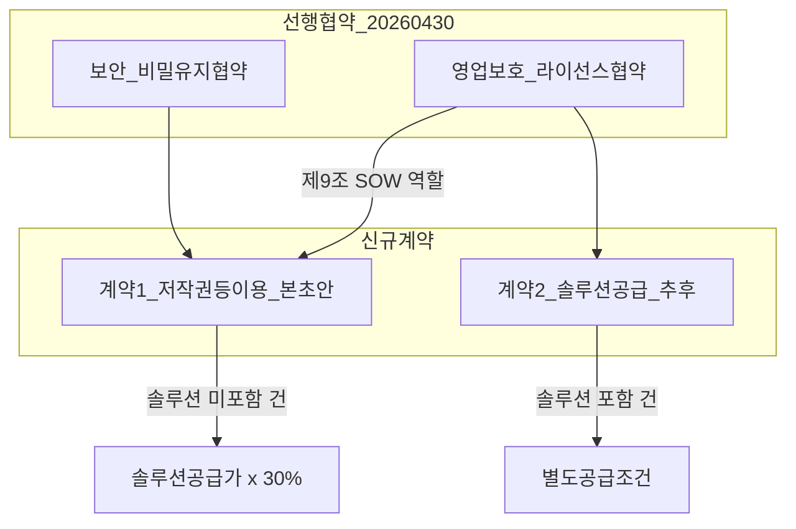

# 저작권 등 이용 계약서 검토 의견

**문서명**: DeepCube - SKAI 저작권 등 이용 계약서 검토 의견서  
**작성일**: 2026년 7월 2일  
**검토 대상**: `output/DeepCube_SKAI_저작권등이용계약서_초안(260702).md`  
**검토 기준**: `working/20260702_00-문서작성지시.md`, 선행 협약(라이선스 협약·비밀유지 협약), SKAI 제품공급계약서 초안(참고)

---

## 1. 검토 개요

### 1.1 목적

본 검토는 신규 계약1(딥큐브 솔루션 미공급 시 DeepCube.AI 저작권 등 이용료 확정)에 대한 계약서 초안이 작업지시서 및 선행 협약과 정합적인지 점검하고, 체결 전 협상·보완이 필요한 사항을 정리하는 것을 목적으로 한다.

### 1.2 산출물

| 파일 | 설명 |
|------|------|
| `DeepCube_SKAI_저작권등이용계약서_초안(260702).md` | 저작권 등 이용 계약서 초안 |
| `DeepCube_SKAI_저작권등이용계약서_검토의견(260702).md` | 본 검토 의견서 |

### 1.3 계약 구조 요약

---

## 2. 작업지시서 충족도 체크리스트

| # | 지시서 항목 | 충족 | 초안 반영 |
|---|-------------|------|-----------|
| 2 | 문서명: 저작권 등 이용 계약서 | ✅ | 문서 제목 및 제1조 |
| 4 | 당사자: 딥큐브 ↔ SKAI | ✅ | 전문 및 서명란 |
| 22-23 | 솔루션 미공급, 라이선스 협약상 사용료 확정 | ✅ | 제1조, 제4조, 제5조 |
| 23 | 계약기간 1년, 30일 전 이의 없으면 1년 연장 | ✅ | 제10조 |
| 28 | 계약2와 분기(솔루션 포함 시 계약2) | ✅ | 제3조 제4항, 제4조 제2항 |
| 32 | 제품 미포함, DeepCube.AI 저작권 이용료 | ✅ | 제5조, 제6조 |
| 33 | Ontovia/동등 제품 판매 시 솔루션 공급가 30% | ✅ | 제4조, 제6조 |
| 34 | DeepCube.AI 지적재산 사용 허용 | ✅ | 제5조 |
| 37-47 | 당사자 상호·주소·대표 | ✅ | 서명란 |
| 49 | 체결일 2026년 7월 __일 | ⚠️ | placeholder 처리 |
| 54 | 계약금액 = 매출 = 솔루션 공급가 + 용역비용 (VAT 별도) | ✅ | 제2조 제8항, 제6조 제3항 |
| 55 | 통보 30일 이내 (당사자, 계약금액, 계약일) | ✅ | 제7조 제1항 |
| 56 | 청구: 계약일 기준 2주 이후 (세금계산서) | ✅ | 제7조 제2항 |
| 57 | 지급: 청구 후 30일 이내 현금 | ✅ | 제7조 제3항 |
| 58 | 월간 합산 등 합의 변경 가능 | ✅ | 제7조 제4항 |
| 61 | 일반 법률 조항: 선행협약과 동일 | ✅ | 제11조~제13조 (라이선스 협약 준용) |

**미충족·placeholder 항목**: 체결일, 사업자등록번호, 입금 계좌, Ontovia/동등 제품의 상세 판단 기준

---

## 3. 선행 협약과의 정합성

### 3.1 라이선스 협약

| 항목 | 선행 협약 | 본 초안 | 평가 |
|------|-----------|---------|------|
| 상업조건 위치 | 제9조: 별도 SOW에 따름 | 본 계약이 SOW 역할 | ✅ 정합 |
| IP 보호 우선 | 제16조: IP 조항 우선 | 제3조 제2항에서 준용 | ✅ 정합 |
| 이용 허락 성격 | 제4조: 비독점·양도불가·재허락 불가 | 제5조에서 준용 | ✅ 정합 |
| 대금 미지급 시 조치 | 제9조: 정지·차단 가능 | 제7조 제5항에서 연동 | ✅ 정합 |
| 감사권 | 제10조 | 제8조 제2항에서 준용 | ✅ 정합 |
| 해지 | 제13조 | 제11조에서 준용 | ✅ 정합 |
| 관할 | 서울중앙지방법원 | 제13조 | ✅ 정합 |
| 계약 기간 | 2년 + 30일 전 연장 | 1년 + 30일 전 연장 | ⚠️ 기간 수치 상이하나, 본 계약은 상업조건 SOW이므로 별도 기간 설정은 타당. 다만 라이선스 협약 만료 후 본 계약만 유효한 경우 해석 정리 권장 |

### 3.2 비밀유지 협약

- 본 초안은 비밀유지 조항을 중복 기재하지 않고 제3조 제3항에서 비밀유지 협약 준용을 명시함. ✅ 적절

### 3.3 권고 사항

체결 전 **라이선스 협약 유효기간과 본 계약 유효기간의 관계**를 SKAI와 확인할 것. 라이선스 협약이 종료되었으나 본 계약만 자동 연장된 경우, 이용 허락의 근거가 불명확해질 수 있음.

---

## 4. SKAI 제품공급계약서 초안과의 차이

`references/딥큐브_스카이월드와이드_제품공급계약서.docx`는 **수용 불가**이며, 본 초안에서 의도적으로 배제한 사항은 다음과 같다.

| SKAI 초안 조항 | 본 초안 처리 | 사유 |
|----------------|--------------|------|
| 딥큐브가 제품 공급자(갑) | 배제 | 계약1은 솔루션 미공급 |
| 매출금액 30% / 공급금액 50% | 배제 | 솔루션 공급가 30%만 적용 |
| 품질보증·하자보수 6개월 | 배제 | 솔루션 미공급이므로 해당 없음 |
| 갑 소재지 관할법원 | 배제 | 선행 협약과 동일하게 서울중앙지방법원 |
| 월말 정산·익월 15일 | 참고만 | 건별 청구 구조 유지, 월간 합산은 합의 가능 |

**참고 반영**: VAT 별도(지시서 명시), 연체이율 연 6%(실무 보완, 제7조 제6항)

---

## 5. 계약1·계약2 분기 구조

| 거래 유형 | 적용 계약 | 저작권 이용료 |
|-----------|-----------|---------------|
| Ontovia/동등 제품 판매, 딥큐브 솔루션 **미포함** | 계약1 (본 초안) | 솔루션 공급가 × 30% |
| 딥큐브 솔루션 **실물 공급** | 계약2 (추후 체결) | 계약2 조건 |
| SKAI 독자 제품 (DeepCube.AI 미이용) | 본 계약 **미적용** | 없음 |

**주의**: 계약2 체결 후에도 계약1은 유효하므로(지시서 28항), 건별로 **솔루션 포함 여부**를 명확히 구분하여 적용 계약을 판단해야 한다. 초안 제4조에서 이를 반영함.

---

## 6. 잔여 리스크 및 협상 포인트

### 6.1 Ontovia / 동등 제품 정의 (중요도: 높음)

- 지시서에는 "Ontovia 혹은 동등한 기능"만 명시되어 있고, 구체 판단 기준은 없음.
- 초안 제2조 제4항에서 **"DeepCube.AI 기존기술을 기능적·구조적으로 이용하는 제품"** 으로 정의했으나, SKAI가 다른 해석을 할 수 있음.
- **협상 포인트**: 동등 제품 판단 시 딥큐브 사전 승인 필요 여부, 분쟁 시 처리 절차

### 6.2 솔루션 공급가 vs 용역비용 구분 (중요도: 높음)

- 30%는 솔루션 공급가에만 적용되므로, SKAI가 용역비용 비중을 높게 산정하면 딥큐브 수익이 감소함.
- **협상 포인트**: 솔루션 공급가·용역비용 구분 기준, 견적서·계약서 사본 제출 의무, 이견 시 협의 절차

### 6.3 체결일·행정 정보 (중요도: 중간)

- 체결일, 사업자등록번호, 입금 계좌 미기재
- **체결 전 확인**: 2026년 7월 중 확정 일자, 양사 사업자번호, 딥큐브 입금 계좌

### 6.4 기술지원 (중요도: 중간)

- 지시서에서 기술지원 포함 문구가 삭제됨
- 초안 제5조 제5항: **별도 포함 안 함**, 라이선스 협약 또는 별도 합의
- SKAI가 무상 기술지원을 기대할 경우 협상 필요

### 6.5 연체이율 (중요도: 낮음)

- 지시서에 없으나 초안에 연 6% 제안 포함
- SKAI가 이의를 제기할 수 있으므로, 협상 시 유지·삭제·조정 결정

### 6.6 원천징수 (중요도: 낮음)

- 제6조 제4항에서 "관계 법령에 따라"만 규정
- 실무상 원천징수 해당 여부·세율은 세무 검토 권장

---

## 7. 체결 전 SKAI와 확인할 사항

1. **체결일** 확정 (2026년 7월 __일)
2. **Ontovia / 동등 제품** 판단 기준 및 사전 승인 절차 합의
3. **솔루션 공급가·용역비용** 구분 방법 및 증빙 제출 범위
4. **기술지원** 포함 여부 (현재 초안: 미포함)
5. **연체이율** 연 6% 수용 여부
6. **입금 계좌** 및 세금계산서 발행 정보
7. **라이선스 협약 기간**과 본 계약 기간의 관계 확인
8. **계약2** 추진 시점 및 계약1과의 적용 분기 운영 방식

---

## 8. 초안 조항별 코멘트

| 조항 | 의도 | 주의점 |
|------|------|--------|
| 제1조 | 라이선스 협약 제9조 SOW 역할 명시, 솔루션 미공급 전제 | 목적 조항으로 계약 성격을 분명히 함 |
| 제2조 | 핵심 용어 정의, 특히 동등 제품·솔루션 공급가 | 분쟁 방지의 핵심; SKAI와 합의 필요 |
| 제3조 | 선행 협약 우선순위, 계약2와 공존 | IP 보호 조항 우선 적용 |
| 제4조 | 적용·비적용 범위, 계약2 분기 | 건별 적용 여부 확인 절차 포함 |
| 제5조 | 건별·조건부 이용 허락, 기술지원 미포함 | 라이선스 협약 제4조 범위 내 |
| 제6조 | 30% 산정, 용역비 제외, VAT 별도 | 지시서 9항 그대로 반영 |
| 제7조 | 통보·청구·지급 일정, 월간 합산, 연체 | 지시서 9항 + 연체이율 실무 보완 |
| 제8조 | 보고·감사, 라이선스 협약 제10조 연동 | 미지급·과소 신고 방지 |
| 제9조 | 권리표시, 라이선스 협약 제8조 연동 | 저작권 표시 삭제 금지 |
| 제10조 | 1년 + 30일 전 자동 연장 | 라이선스 협약과 동일 체계 |
| 제11조 | 해지, 기청구분 존속 | 만료 후에도 기존 건 로열티 의무 유지 |
| 제12조 | 손해배상·면책 | 라이선스 협약 제11·12조 요지 |
| 제13조 | 준거법·관할 | 선행 협약과 동일 |
| 제14조 | 서면 변경, 통지, 2부 작성 | 일반 조항 |

---

## 9. 종합 의견

### 9.1 작성 가능성

작업지시서의 핵심 요건(솔루션 미공급, 30% 로열티, 건별 정산, 1년 자동 연장, 선행 협약 연동)은 **본 초안에 반영 완료**되었다. SKAI와의 1차 협상용 초안으로 사용 가능한 수준이다.

### 9.2 체결 전 필수 보완

1. 체결일·사업자등록번호·입금 계좌 기재
2. Ontovia/동등 제품 및 솔루션 공급가 구분 기준 SKAI 합의
3. 라이선스 협약 기간과의 관계 확인

### 9.3 권고

- 본 초안을 SKAI에 전달하기 전, **제2조(정의)** 와 **제7조(통보·청구·지급)** 를 내부적으로 우선 검토할 것.
- 계약2 추진 시, 계약1과의 **적용 분기표**(거래 유형별 적용 계약·요율)를 별첨으로 작성하는 것을 권장한다.

---

*본 검토 의견은 법률 자문을 대체하지 않으며, 체결 전 변호사 검토를 권장합니다.*
