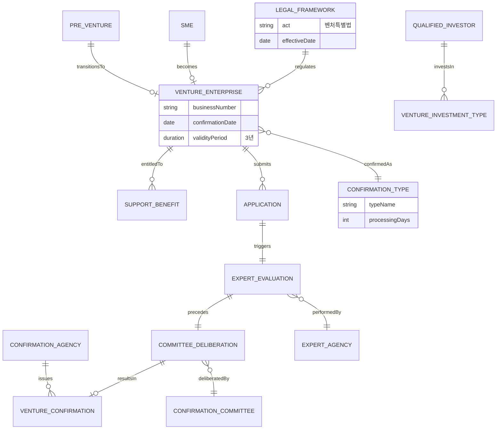

# 벤처기업 제도 온톨로지

> 작성일: 2026-07-03 (업데이트: 근거자료 최신화 검증)  
> 범위: 대한민국 「벤처기업육성에 관한 특별법」 기반 **벤처기업확인제도** 및 **소셜벤처기업 판별제도**  
> **1차 근거**: [2026 벤처기업확인제도 가이드북](https://www.smes.go.kr/venturein/board/viewArchBoard?menuId=4080000&bbsSn=5861) (게시 2026-04-06)

---

## 0. 근거자료 검증 (2026-07-03)

| 자료 | 기존 인용 | 검증 결과 | 최신 자료 |
|------|-----------|-----------|-----------|
| **벤처기업확인 가이드북** | 2023 개정판 PDF | **구버전** — 자료실 최상단에 2026판 게시 | [[2026] 가이드북](https://www.smes.go.kr/venturein/board/viewArchBoard?menuId=4080000&bbsSn=5861) · [자료실 목록](https://www.smes.go.kr/venturein/board/viewArchBoardList) |
| **벤처기업확인요령** | 행정규칙 일반 링크 | **개정** — 2025.4.1 시행 | [고시 제2025-28호](https://www.mss.go.kr/site/smba/ex/bbs/View.do?bcIdx=1057695&cbIdx=127) · [law.go.kr](https://www.law.go.kr/행정규칙/벤처기업확인요령) |
| **평가지표** | 가이드북 Part 3 | **보완** — ESG 항목·2025 지표 별도 공개 | [평가지표(2025년 버전)](https://www.smes.go.kr/venturein/board/viewArchBoard?menuId=4080000&bbsSn=5286) · [ESG 자가진단 가이드](https://www.smes.go.kr/venturein/board/viewArchBoard?menuId=4080000&bbsSn=3829) |
| **벤처특별법 시행령** | — | **개정** — 2026.1.1 시행 | [시행령](https://www.law.go.kr/LSW/lsInfoP.do?lsiSeq=281855) (대통령령 제35993호, 2025.12.30 공포) |
| **소셜벤처 운영요령** | 2021 고시 PDF | **부분 개정** — 2024-57호 개정 보도 | [운영요령(2021)](https://dams.pa.go.kr/dams/DOCUMENT/2023/11/30/DOC/SRC/0A04202311301640183855019015421.pdf) · [개정 보도](https://www.mss.go.kr/site/smba/ex/bbs/View.do?bcIdx=1046757&cbIdx=86) |
| **벤처확인 통계** | 2022년 유형 비중 | **갱신 필요** — 홈페이지 2025년 기준 | [벤처인 홈](https://www.smes.go.kr/venturein/home/viewHome) (벤처확인기업 38,598개사, 2025년) |
| **제도 변화(2026)** | ventureinkorea 블로그 | **2차 자료** — 공식 가이드북 우선 | 2026 가이드북·중기부 보도자료 우선 참조 |

**2025.4.1 이후 주요 제도 변화** (확인요령 개정, [중기부 보도](https://www.mss.go.kr/site/smba/ex/bbs/View.do?bcIdx=1057693&cbIdx=86)):
- 해외 신생 벤처캐피탈 투자 → 적격 투자실적 인정 범위 확대
- 연구개발·혁신성장유형 사업성장성 평가에 **ESG 경영 도입 실적** 정성 평가 신설 (환경·사회·지배구조 14개 세부지표)

> 구버전 가이드북(2023 PDF)은 [이 링크](https://www.smes.go.kr/venturein/file/download?key=%2Fpublic%2Frequireguide%2F%EB%B2%A4%EC%B2%98%EA%B8%B0%EC%97%85%ED%99%95%EC%9D%B8%EC%A0%9C%EB%8F%84+%EA%B0%80%EC%9D%B4%EB%93%9C%EB%B6%81%2823%EB%85%84+%EA%B0%9C%EC%A0%95%ED%8C%90%29.pdf)에서 여전히 열리나, 표지에「2023 개정판」으로 구분됨. 본 문서의 수치·절차는 2026 가이드북·2025 확인요령과 교차 확인 권장.

---

## 1. 온톨로지 개요

본 온톨로지는 한국 벤처기업 제도의 **개념·관계·절차·혜택**을 구조화한 지식 모델이다. 법적 정의, 확인 유형, 심사 주체, 지원 제도 간의 관계를 명시하여 정책 분석·신청 전략·시스템 설계에 활용할 수 있다.

### 1.1 네임스페이스

| 접두사 | URI | 설명 |
|--------|-----|------|
| `kv:` | `https://venture.korea/ontology#` | 벤처기업 제도 온톨로지 |
| `law:` | `https://www.law.go.kr/법령/` | 국가법령 참조 |
| `org:` | `https://venture.korea/org#` | 기관·조직 |

---

## 2. 클래스 계층 (Class Hierarchy)

```
kv:Thing
├── kv:LegalFramework
│   ├── kv:Act                    # 벤처기업육성에 관한 특별법
│   ├── kv:EnforcementDecree      # 시행령
│   ├── kv:EnforcementRule        # 시행규칙
│   └── kv:ConfirmationGuideline  # 벤처기업확인요령
│
├── kv:Organization
│   ├── kv:ConfirmationAgency     # 벤처기업확인기관 ((사)벤처기업협회)
│   ├── kv:ConfirmationCommittee  # 벤처기업확인위원회
│   ├── kv:ExpertEvaluationAgency # 전문평가기관
│   ├── kv:QualifiedInvestor      # 적격투자기관
│   ├── kv:SocialVentureDiscernmentAgency  # 소셜벤처기업 판별기관 (기술보증기금 등)
│   └── kv:CivilAdvisoryCommittee # 민간자문위원회 (소셜벤처)
│
├── kv:Enterprise
│   ├── kv:SME                    # 중소기업 (중소기업기본법 제2조)
│   ├── kv:VentureEnterprise      # 벤처기업 (확인 완료)
│   ├── kv:PreVentureEnterprise   # 예비벤처기업
│   ├── kv:StartupVenture         # 창업벤처기업 (창업 3년 이내 확인)
│   └── kv:SocialVentureEnterprise # 소셜벤처기업 (판별 완료)
│
├── kv:ConfirmationType           # 확인 유형 (4종)
│   ├── kv:VentureInvestmentType  # 벤처투자유형
│   ├── kv:RDType                 # 연구개발유형
│   ├── kv:InnovationGrowthType   # 혁신성장유형
│   └── kv:PreVentureType         # 예비벤처유형
│
├── kv:Document
│   ├── kv:VentureConfirmation     # 벤처기업확인서
│   ├── kv:SocialVentureNotice     # 소셜벤처기업 판별 결과 통지서
│   ├── kv:SMEConfirmation        # 중소기업확인서
│   └── kv:BusinessPlan           # 사업계획서
│
├── kv:Process
│   ├── kv:Application            # 신청
│   ├── kv:ReceiptAndPayment      # 접수 및 납부
│   ├── kv:ExpertEvaluation       # 전문평가기관 평가
│   ├── kv:CommitteeDeliberation  # 확인위원회 심의·의결
│   ├── kv:CertificateIssuance    # 확인서 발급
│   ├── kv:Reconfirmation         # 재확인(연장)
│   └── kv:Appeal                 # 이의신청
│
├── kv:Evaluation
│   ├── kv:RequirementReview      # 요건 심사
│   ├── kv:OnSiteInvestigation    # 현장실제조사
│   ├── kv:TechInnovationEval     # 기술 혁신성 평가
│   ├── kv:BusinessGrowthEval     # 사업 성장성 평가
│   ├── kv:ESGManagementEval      # ESG 경영 도입 실적 평가 (2025.4~)
│   ├── kv:SocialValueEval        # 사회성 평가 (소셜벤처)
│   └── kv:InnovationGrowthEval   # 혁신성장성 평가 (소셜벤처)
│
├── kv:SupportBenefit             # 우대·지원 혜택
│   ├── kv:TaxBenefit             # 세제 혜택
│   ├── kv:FinanceBenefit         # 금융 혜택
│   ├── kv:LocationBenefit        # 입지 혜택
│   ├── kv:HRBenefit              # 인력 혜택
│   ├── kv:IPBenefit              # 지식재산 혜택
│   └── kv:ProcurementBenefit     # 조달·판로 혜택
│
└── kv:Platform
    ├── kv:VentureIn              # 벤처확인종합관리시스템 (2026 통합 플랫폼)
    └── kv:SocialVentureSquare    # 소셜벤처스퀘어 (sv.kibo.or.kr)
```

---

## 3. 핵심 클래스 정의

### 3.1 kv:VentureEnterprise (벤처기업)

| 속성 | 값 |
|------|-----|
| **법적 근거** | 벤처특별법 제2조의2 |
| **정의** | 기술의 혁신성과 사업의 성장성이 우수하여 벤처기업확인기관이 확인한 중소기업 |
| **필수 조건** | 중소기업 해당 + 4가지 확인 유형 중 하나의 요건 충족 + 위원회 심의·의결 |
| **유효기간** | 확인서 발급일로부터 3년 |
| **제외 업종** | 일반·무도 유흥 주점업, 블록체인 기반 암호화자산 매매·중개업, 사행시설 관리·운영업, 무도장 운영업 등 |

> 출처: [2026 가이드북](https://www.smes.go.kr/venturein/board/viewArchBoard?menuId=4080000&bbsSn=5861), [벤처기업육성에 관한 특별법 제2조의2](https://www.law.go.kr/법령/벤처기업육성에관한특별법/제2조의2)

### 3.1a kv:SocialVentureEnterprise (소셜벤처기업)

| 속성 | 값 |
|------|-----|
| **법적 근거** | 벤처특별법 제2조⑩, 제16조의10 (2021.4.20 신설, 조문번호 개정 이력 있음) |
| **정의** | 사회적 가치와 경제적 가치를 **통합적으로** 추구하는 기업으로서 판별 요건을 갖춘 기업 |
| **판별 기준** | 사회성 판별표 **70점 이상** AND 혁신성장성 판별표 **70점 이상** (각각 독립 산정) |
| **신청 자격** | 영리법인(주식회사·유한회사·유한책임회사 등), 영 제2조의4 제외 업종 |
| **판별기관** | 기술보증기금 (주 판별기관), 중소벤처기업부 지정 기관 |
| **결과 문서** | 소셜벤처기업 판별 결과 통지서 (유효기간 없음 — 판별 시점 기준) |
| **처리 기한** | 신청일로부터 **21일 이내** (1회 7일 연장 가능) |
| **신청 전제** | 자가진단표에서 사회성·혁신성장성 각 **60점 이상** 시에만 신청 가능 |
| **벤처기업과의 관계** | **별도 제도**. 다만 벤처기업 확인 보유 시 혁신성장성 판별표 1항에서 **100점** 인정 |

> 출처: [소셜벤처기업 지원제도 운영요령(중소벤처기업부 고시)](https://dams.pa.go.kr/dams/DOCUMENT/2023/11/30/DOC/SRC/0A04202311301640183855019015421.pdf), [벤처기업육성에 관한 특별법 제16조의10](https://www.law.go.kr/법령/벤처기업육성에관한특별법/(2023,1,3,2023013)/제16조의10), [소셜벤처스퀘어](https://sv.kibo.or.kr/)

### 3.2 kv:ConfirmationType (확인 유형)

4가지 확인 유형은 **상호 배타적 선택**이 아니라, 기업 상황에 맞는 **단일 유형으로 신청**한다. 성장 단계에 따라 유형 전환이 가능하다.

| 클래스 | 법 조항 | 핵심 판단 기준 |
|--------|---------|----------------|
| `kv:VentureInvestmentType` | 제2조의2①②가목 | 적격투자기관 투자 실적 |
| `kv:RDType` | 제2조의2①②나목 | 연구조직 + R&D비 규모·비율 + 사업성장성 |
| `kv:InnovationGrowthType` | 제2조의2①②다목 | 기술혁신성 + 사업성장성 종합 평가 |
| `kv:PreVentureType` | 제2조의2①②라목 | 예비창업자/초기기업의 기술혁신성 + 사업성장성 |

### 3.3 kv:ConfirmationAgency (벤처기업확인기관)

| 속성 | 값 |
|------|-----|
| **지정 근거** | 벤처특별법 제46조 |
| **현행 기관** | (사)벤처기업협회 |
| **역할** | 단일창구 접수, 전문평가기관 배정, 확인위원회 운영, 확인서 발급 |
| **2021 개편** | 2021.2.12부터 민간주도 단일창구 체계로 전면 개편 |

### 3.4 kv:ExpertEvaluationAgency (전문평가기관)

| 확인 유형 | 전문평가기관 | 평가 내용 |
|-----------|-------------|-----------|
| 벤처투자유형 | 한국벤처캐피탈협회 | 투자요건 충족 여부 |
| 연구개발유형 | 신용보증기금, 중소벤처기업진흥공단 | 연구조직·R&D비 요건, 사업성장성 |
| 혁신성장유형 | 기술보증기금 등 9개 기관 | 기술혁신성·사업성장성 |
| 예비벤처유형 | 기술보증기금 | 기술혁신성·사업성장성 |

---

## 4. 객체 속성 (Object Properties)

| 속성 | 도메인 | 레인지 | 설명 |
|------|--------|--------|------|
| `kv:regulatedBy` | kv:VentureEnterprise | kv:LegalFramework | 법령에 의해 규율됨 |
| `kv:confirmedAs` | kv:Enterprise | kv:ConfirmationType | 특정 유형으로 확인됨 |
| `kv:issues` | kv:ConfirmationAgency | kv:VentureConfirmation | 확인서 발급 |
| `kv:evaluatedBy` | kv:Enterprise | kv:ExpertEvaluationAgency | 전문평가기관 평가 |
| `kv:deliberatedBy` | kv:VentureEnterprise | kv:ConfirmationCommittee | 위원회 최종 심의 |
| `kv:receivesInvestmentFrom` | kv:Enterprise | kv:QualifiedInvestor | 적격투자기관 투자 유치 |
| `kv:entitledTo` | kv:VentureEnterprise | kv:SupportBenefit | 혜택 수혜 자격 |
| `kv:appliedThrough` | kv:Application | kv:Platform | 벤처인 플랫폼 신청 |
| `kv:precedes` | kv:Process | kv:Process | 절차 선후 관계 |
| `kv:transitionsTo` | kv:PreVentureEnterprise | kv:VentureEnterprise | 예비→정식 벤처 전환 |
| `kv:excludedIndustry` | kv:Enterprise | kv:Industry | 확인 제외 업종 |
| `kv:discernedAs` | kv:Enterprise | kv:SocialVentureEnterprise | 소셜벤처 판별 |
| `kv:satisfiesSocialValue` | kv:SocialVentureEnterprise | kv:SocialValueEval | 사회성 70점 이상 |
| `kv:satisfiesInnovationGrowth` | kv:SocialVentureEnterprise | kv:InnovationGrowthEval | 혁신성장성 70점 이상 |
| `kv:reinforces` | kv:VentureEnterprise | kv:InnovationGrowthEval | 벤처확인이 혁신성장성 점수에 기여 |

### 4.1 확인 절차 순서 (kv:precedes)

```
kv:Application
  → kv:ReceiptAndPayment
  → kv:ExpertEvaluation
  → kv:CommitteeDeliberation
  → kv:CertificateIssuance
```

---

## 5. 데이터 속성 (Data Properties)

| 속성 | 타입 | 적용 대상 | 설명 |
|------|------|-----------|------|
| `kv:validityPeriod` | xsd:duration | kv:VentureConfirmation | 유효기간 (P3Y = 3년) |
| `kv:minimumInvestment` | xsd:integer | kv:VentureInvestmentType | 최소 투자금 (50,000,000 KRW) |
| `kv:investmentRatio` | xsd:decimal | kv:VentureInvestmentType | 자본금 대비 투자비율 (0.10, 문화콘텐츠 0.07) |
| `kv:minimumRDCost` | xsd:integer | kv:RDType | 직전 4분기 R&D비 합계 (50,000,000 KRW) |
| `kv:rdCostRatio` | xsd:decimal | kv:RDType | 매출 대비 R&D비 비율 (업종별 5~10%) |
| `kv:processingDays` | xsd:integer | kv:ConfirmationType | 처리 기한 (30 또는 45일) |
| `kv:confirmationFee` | xsd:integer | kv:ConfirmationType | 확인수수료 (VAT 포함) |
| `kv:enterpriseBurden` | xsd:integer | kv:ConfirmationType | 기업부담금 |
| `kv:governmentSubsidy` | xsd:integer | kv:ConfirmationType | 정부지원금 |
| `kv:appealPeriod` | xsd:duration | kv:Appeal | 이의신청 기간 (P30D) |
| `kv:socialValueThreshold` | xsd:integer | kv:SocialVentureEnterprise | 사회성 합격 점수 (70) |
| `kv:innovationGrowthThreshold` | xsd:integer | kv:SocialVentureEnterprise | 혁신성장성 합격 점수 (70) |
| `kv:selfDiagThreshold` | xsd:integer | kv:SocialVentureEnterprise | 자가진단 신청 가능 점수 (60) |

---

## 6. 관계 다이어그램



---

## 7. 인스턴스 예시 (Individual Assertions)

```turtle
@prefix kv: <https://venture.korea/ontology#> .
@prefix org: <https://venture.korea/org#> .
@prefix xsd: <http://www.w3.org/2001/XMLSchema#> .

# 제도
kv:VentureConfirmationSystem a kv:Platform ;
    rdfs:label "벤처인(VentureIn)"@ko ;
    kv:url "https://www.smes.go.kr/venturein" .

org:KoreaVentureAssociation a kv:ConfirmationAgency ;
    rdfs:label "(사)벤처기업협회"@ko .

org:KVCA a kv:ExpertEvaluationAgency ;
    kv:evaluatesType kv:VentureInvestmentType .

# 확인 유형
kv:VentureInvestmentType a kv:ConfirmationType ;
    kv:minimumInvestment "50000000"^^xsd:integer ;
    kv:investmentRatio "0.10"^^xsd:decimal ;
    kv:processingDays "30"^^xsd:integer ;
    kv:confirmationFee "275000"^^xsd:integer .

kv:RDType a kv:ConfirmationType ;
    kv:minimumRDCost "50000000"^^xsd:integer ;
    kv:rdCostRatio "0.05"^^xsd:decimal ;
    kv:processingDays "45"^^xsd:integer ;
    kv:confirmationFee "495000"^^xsd:integer .

# 혜택
kv:StartupTaxReduction a kv:TaxBenefit ;
    rdfs:label "창업벤처 소득세·법인세 감면"@ko ;
    kv:reductionRate "0.50"^^xsd:decimal ;
    kv:maxYears "5"^^xsd:integer .
```

---

## 8. 제도 진화 타임라인 (Temporal Ontology)

| 시기 | 이벤트 | 온톨로지 영향 |
|------|--------|---------------|
| 1997.08 | 벤처특별법 제정 | `kv:Act` 생성, 한시법 |
| 1998 | 벤처기업확인제도 시행 | `kv:ConfirmationType` 도입 |
| 2019 | 예비벤처유형 도입 | `kv:PreVentureType` 클래스 추가 |
| 2021.02.12 | 민간주도 단일창구 개편 | `kv:ConfirmationAgency` 역할 재정의 |
| 2021.04.20 | 소셜벤처기업 법적 정의 신설 (제16조의10) | `kv:SocialVentureEnterprise` 클래스 추가 |
| 2021 | 법 상시화 (한시법 폐지) | `kv:Act` 영구 법률화 |
| 2021.07.21 | 소셜벤처기업 판별제도 시행 (운영요령) | `kv:SocialVentureSquare` 플랫폼 운영 |
| 2022.07 | 소셜벤처 실태조사 국가승인통계 전환 | 승인번호 제142020호 |
| 2026.04.06 | [2026] 벤처기업확인제도 가이드북 게시 | 공식 신청·제도 안내 1차 자료 갱신 |
| 2026 상반기 | 벤처인 플랫폼 완전 온라인화 | `kv:VentureIn` 강화, 처리기간 단축 목표 |
| 2025.04.01 | 벤처기업확인요령 개정 (고시 제2025-28호) | ESG 평가·해외 VC 투자 인정 확대 |

---

## 9. 적격투자기관 온톨로지 (kv:QualifiedInvestor 하위)

```
kv:QualifiedInvestor
├── kv:VCC                    # 중소기업창업투자회사
├── kv:InstitutionalPEF       # 기관전용 사모집합투자기구
├── kv:VentureInvestmentFund  # 벤처투자조합
├── kv:PersonalInvestmentFund # 개인투자조합
├── kv:AngelInvestor          # 전문개인투자자(전문엔젤)
├── kv:Accelerator            # 창업기획자(엑셀러레이터)
├── kv:TechHoldingCompany     # 첨단기술지주회사
├── kv:PublicResearchOrg      # 공공연구기관
├── kv:Crowdfunding           # 크라우드펀딩
└── kv:FinancialInstitution   # 중소기업은행, 기술보증기금, 신용보증기금 등
```

**제약 조건**: 2021.2.12 이후 투자유치 건(입금일 기준)만 인정 (`kv:investmentDate >= 2021-02-12`)

---

## 10a. 소셜벤처기업 판별 온톨로지

### 10a.1 제도 구조

```
kv:SocialVentureEnterprise
  --kv:regulatedBy--> 벤처특별법 제16조의10
  --kv:discernedBy--> kv:SocialVentureDiscernmentAgency (기술보증기금)
  --kv:appliedThrough--> kv:SocialVentureSquare
  --kv:issues--> kv:SocialVentureNotice (판별 결과 통지서)
  --kv:satisfiesSocialValue--> kv:SocialValueEval (≥70점)
  --kv:satisfiesInnovationGrowth--> kv:InnovationGrowthEval (≥70점)
```

### 10a.2 사회성 판별표 주요 항목 (별표2)

| 항목 | 최대 점수 | 비고 |
|------|:--------:|------|
| 사회적 경제기업 인증 (사회적기업·협동조합·B-corp 등) | 100 | 예비사회적기업 70점 |
| 사회적 문제 해결 제품·서비스 사업화 | 70 | K-SDGs 연계 |
| 정관에 사회적 가치·문제 명시 | 50 | 정관 외 증빙 50% 인정 |
| 사회적 성과 측정·보고체계 | 50 | |
| 이윤 배분·청산 제한 원칙 | 30 | |
| 이해관계자 의사결정 참여 | 30 | |
| 소셜임팩트 투자 유치 | 100 | |
| 사회적경제·소셜벤처 대회 수상 | 30 | |
| 육성사업 참여·창업 | 20 | |
| 사회적가치 파트너십 (MOU 등) | 20 | |
| 대표자 사회적 가치 창출 경력·교육 | 10 | |

### 10a.3 혁신성장성 판별표 주요 항목 (별표2)

| 항목 | 최대 점수 | 비고 |
|------|:--------:|------|
| **벤처기업·이노비즈·메인비즈 인증 보유** | **100** | 벤처확인과 직접 연계 |
| 중앙정부 기술인증·TCB T4·기보 BBB+ | 70 | B등급 50점 |
| 혁신성장공동기준 해당 품목·기술 | 30 | |
| 매출·고용 연평균 증가율 (수도권 20%+) | 100 | 지방 10%, 5인 이상 기업 50점 |
| 투자 50백만원+ (벤처·정부·사회적경제) | 100 | 50백만 미만 50점 |
| 창업지원플랫폼 입주·보육 | 30 | |
| 창업·벤처 지원사업 30백만원+ 선정 | 30 | |
| 지식재산권 보유 | 40+ | 1건 40점, 추가 건당 5점 |
| 매출 대비 R&D비 5%+ | 50 | 3% 30점 |
| 기업부설연구소·R&D전담부서 | 30 | |
| 창업경진대회 수상 | 30 | |
| 대표자 기술역량 (박사·기술사·연구원 경력) | 10 | |

> 출처: [소셜벤처기업 지원제도 운영요령 별표2](https://dams.pa.go.kr/dams/DOCUMENT/2023/11/30/DOC/SRC/0A04202311301640183855019015421.pdf)

### 10a.4 소셜벤처 지원 혜택 (법 제16조의10②)

```
kv:SocialVentureEnterprise --kv:entitledTo-->
  ├── 기술보증 및 투자
  ├── 예비창업자·창업자 발굴·육성 (육성사업)
  ├── 실태조사 기반 정책 지원
  └── 소셜벤처 육성사업 (중간지원조직 포함)
```

---

## 10. 평가 온톨로지 (Evaluation Dimensions)

### 10.1 기술 혁신성 (kv:TechInnovationEval)

| 지표 | 연구개발유형 | 혁신성장유형 | 예비벤처유형 |
|------|-------------|-------------|-------------|
| 연구조직·기술인력 전문성 | - | 20~30% | 20% |
| R&D비 투자현황 | 요건 심사 | 10~20% | - |
| 기술개발 계획 적절성 | - | 10~30% | 40% |
| R&D 실적 | - | 10~20% | - |
| 기술 차별성 | - | 10~30% | 40% |
| 지식재산권 보유 | - | 10% | (역량 판단 요소) |

### 10.2 사업 성장성 (kv:BusinessGrowthEval)

| 지표 | 연구개발유형 | 혁신성장유형 | 예비벤처유형 |
|------|-------------|-------------|-------------|
| 고용상승률 | 10% | 10% | - |
| 목표시장 적절성 | 20% | 20% | 40% |
| 사업계획 적절성 | 30~50% | 30~50% | 40% |
| 협업 실적 | 10% | 10% | - |
| 자금운용 계획 | 20% | 20% | 20% |
| 사업성과 | 20% (재확인) | 20% (재확인) | - |

---

## 11. 혜택 온톨로지 (Support Benefit Network)

```
kv:VentureEnterprise --kv:entitledTo--> kv:SupportBenefit

kv:TaxBenefit
  ├── 소득세·법인세 50% 감면 (창업벤처, 최대 5년)
  ├── 취득세·재산세 경감 (확인 후 4~5년 내 부동산 취득)
  └── 벤처기업집적시설 취득세 37.5% 감면

kv:FinanceBenefit
  ├── 기술보증기금 보증한도 확대 (50억, 이행보증 70억)
  ├── 코스닥 상장 심사기준 우대
  └── M&A 대기업집단 편입 7~10년 유예

kv:HRBenefit
  ├── 스톡옵션 한도 50% (일반 10~20%)
  ├── 연구전담요원 기준 완화 (2명 이상)
  ├── 전문연구요원·산업기능요원 병역 우대
  └── R&D 인력 지원사업 가점

kv:ProcurementBenefit
  ├── 조달청 적격심사 가점 (1.5~2점)
  └── 수출바우처 자동선정
```

---

## 12. 활용 시나리오

### 시나리오 A: VC 투자 완료 스타트업

```
Enterprise --receivesInvestmentFrom--> QualifiedInvestor
Enterprise --confirmedAs--> VentureInvestmentType
ExpertEvaluation --evaluatedBy--> KVCA
```

### 시나리오 B: R&D 집약 제조기업

```
Enterprise --has--> RDOrganization
Enterprise --confirmedAs--> RDType
ExpertEvaluation --evaluatedBy--> KODIT | KOSME
```

### 시나리오 C: 예비창업팀 → 정식 벤처

```
PreVentureEnterprise --confirmedAs--> PreVentureType
PreVentureEnterprise --transitionsTo--> VentureEnterprise
VentureEnterprise --confirmedAs--> InnovationGrowthType | RDType | VentureInvestmentType
```

### 시나리오 D: 소셜벤처 + 벤처기업 이중 인증

```
Enterprise --confirmedAs--> VentureEnterprise (혁신성장유형)
Enterprise --discernedAs--> SocialVentureEnterprise
SocialValueEval --score--> 70+
InnovationGrowthEval --score--> 70+ (벤처확인으로 1항 100점 확보)
```

---

## 13. 참고 자료 및 출처

### 13.1 법령

| 자료 | 시행·공포 | URL |
|------|-----------|-----|
| 벤처기업육성에 관한 특별법 | 현행 | https://www.law.go.kr/법령/벤처기업육성에관한특별법 |
| 벤처기업육성에 관한 특별법 시행령 | **2026.1.1** (제35993호) | https://www.law.go.kr/법령/벤처기업육성에관한특별법시행령 |
| 벤처기업육성에 관한 특별법 시행규칙 | 현행 | https://www.law.go.kr/법령/벤처기업육성에관한특별법시행규칙 |
| 벤처기업확인요령 | **2025.4.1** (고시 제2025-28호) | https://www.law.go.kr/행정규칙/벤처기업확인요령 · [중기부 고시](https://www.mss.go.kr/site/smba/ex/bbs/View.do?bcIdx=1057695&cbIdx=127) |

### 13.2 벤처기업확인제도

| 자료 | 게시·시행 | URL |
|------|-----------|-----|
| **[2026] 벤처기업확인제도 가이드북** (최신) | 2026-04-06 | https://www.smes.go.kr/venturein/board/viewArchBoard?menuId=4080000&bbsSn=5861 |
| 벤처기업확인 평가지표 (2025년 버전) | 자료실 | https://www.smes.go.kr/venturein/board/viewArchBoard?menuId=4080000&bbsSn=5286 |
| 사업계획서 작성예시·ESG 자가진단 가이드 | 2022-11-30 | https://www.smes.go.kr/venturein/board/viewArchBoard?menuId=4080000&bbsSn=3829 |
| 벤처기업확인제도 가이드북 (2023 개정판, 구버전) | — | https://www.smes.go.kr/venturein/file/download?key=%2Fpublic%2Frequireguide%2F%EB%B2%A4%EC%B2%98%EA%B8%B0%EC%97%85%ED%99%95%EC%9D%B8%EC%A0%9C%EB%8F%84+%EA%B0%80%EC%9D%B4%EB%93%9C%EB%B6%81%2823%EB%85%84+%EA%B0%9C%EC%A0%95%ED%8C%90%29.pdf |
| 벤처인(VentureIn) 통합 플랫폼 | — | https://www.smes.go.kr/venturein |
| 벤처기업확인서 발급신청 (정부24) | — | https://www.gov.kr/mw/AA020InfoCappView.do?CappBizCD=14200000010 |
| 확인요령 개정 보도 (ESG·해외VC) | 2025-04-01 | https://www.mss.go.kr/site/smba/ex/bbs/View.do?bcIdx=1057693&cbIdx=86 |
| 벤처기업확인 고객센터 | — | 1566-6487 |

### 13.3 소셜벤처기업

| 자료 | 시행·공포 | URL |
|------|-----------|-----|
| 소셜벤처기업 지원제도 운영요령 (2021) | 2021.7.21 | https://dams.pa.go.kr/dams/DOCUMENT/2023/11/30/DOC/SRC/0A04202311301640183855019015421.pdf |
| 운영요령 일부개정 (고시 제2024-57호) | 2024.8 | https://www.mss.go.kr/site/smba/ex/bbs/View.do?bcIdx=1046757&cbIdx=86 |
| 소셜벤처스퀘어 | — | https://sv.kibo.or.kr/ |
| 소셜벤처기업 실태조사 | 국가승인통계 제142020호 | https://mods.go.kr/boardDownload.es?bid=12013&list_no=437453&seq=1 |

### 13.4 본 문서 인용 구간

| 섹션 | 주요 출처 (검증 후) |
|------|---------------------|
| §0 근거자료 검증 | 벤처인 자료실·중기부 고시·law.go.kr (2026-07-03) |
| §3.1 벤처기업 정의·요건 | 2026 가이드북, 벤처특별법 제2조의2 |
| §3.1a 소셜벤처기업 | 운영요령(2021/2024 개정), 벤처특별법 제16조의10 |
| §8 타임라인 | 가이드북·법령 연혁·확인요령 개정 |
| §9 적격투자기관 | 2026 가이드북 + 확인요령(2025) 해외VC 확대 |
| §10a 소셜벤처 판별표 | 운영요령 별표2 |
| §11 혜택 | 2026 가이드북 우대지원제도, 벤처특별법 제16조 |
